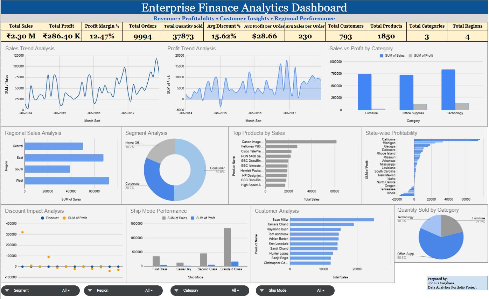
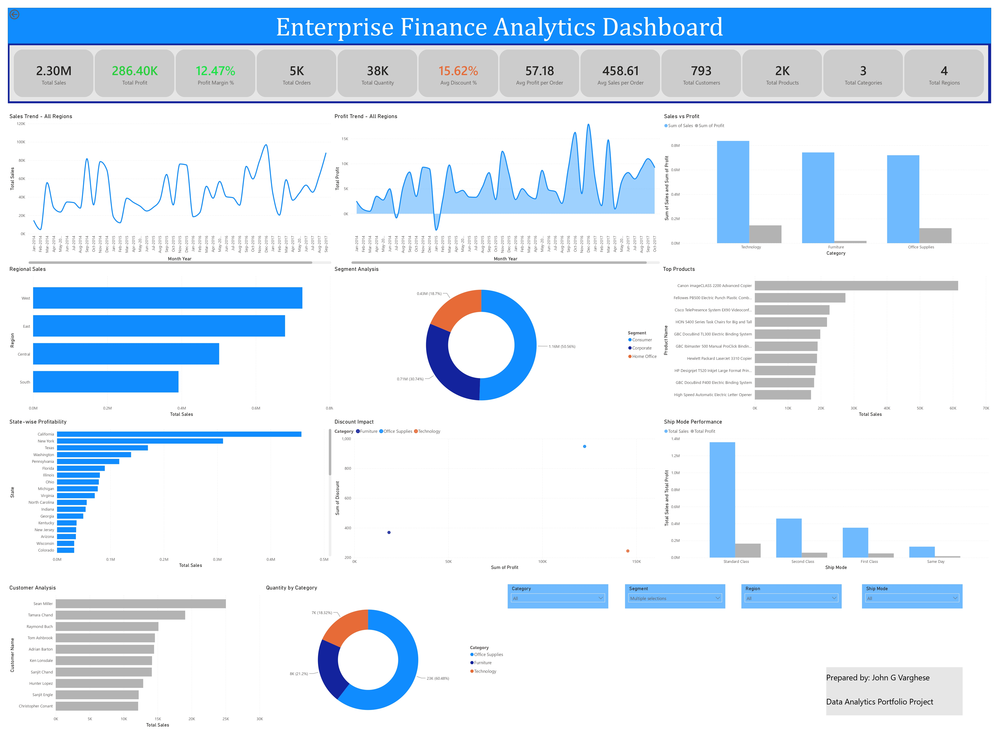

# 💰 Enterprise Finance Analytics Dashboard

## Dashboard Preview – Google Sheets

---

## Dashboard Preview – Power BI

---

## Project Overview

This project presents a comprehensive Enterprise Finance Analytics Dashboard developed using Google Sheets and Power BI.

The dashboard enables finance teams and business leaders to monitor financial performance, profitability, revenue growth, expense trends, and key financial indicators through interactive reporting and data visualization.

---

## Business Problem

Organizations generate large volumes of financial data across revenue streams, expenses, budgets, and operational activities.

Management requires a centralized analytics solution to:

* Monitor financial performance
* Track revenue and profitability trends
* Analyze expense distribution
* Evaluate business growth
* Support budgeting and forecasting
* Improve financial decision-making

---

## Dashboard Objectives

* Improve visibility into financial performance
* Monitor revenue and profit trends
* Analyze expenses and cost drivers
* Evaluate profitability metrics
* Support strategic financial planning
* Enable data-driven business decisions

---

## Key Metrics Tracked

* Total Revenue
* Total Expenses
* Net Profit
* Profit Margin %
* Revenue Growth %
* Expense Ratio
* Budget vs Actual Performance
* Monthly Financial Performance
* Department-wise Revenue
* Department-wise Profitability

---

## Dashboard Features

### Executive Financial Overview

Provides a high-level summary of financial KPIs.

### Revenue Analysis

Tracks revenue performance and growth trends.

### Profitability Analysis

Monitors profit margins and financial health.

### Expense Analysis

Breaks down operating expenses and spending patterns.

### Budget Performance

Compares budgeted figures against actual performance.

### Department Performance

Evaluates financial contribution by department or business unit.

### Financial Trend Analysis

Tracks financial performance over time.

---

## Tools & Technologies

### Google Sheets

* Pivot Tables
* Financial Reporting
* Dashboard Design
* KPI Reporting
* Charts & Visualizations

### Power BI

* Power Query
* DAX
* Data Modeling
* Interactive Dashboards
* Financial Analytics

---

## Skills Demonstrated

* Financial Analytics
* Revenue Analysis
* Profitability Analysis
* Expense Management Reporting
* KPI Development
* Dashboard Design
* Data Cleaning
* Data Transformation
* Business Intelligence Reporting

---

## Business Insights Generated

* Identified key revenue drivers.
* Evaluated profitability trends across departments.
* Monitored expense distribution and cost patterns.
* Compared budget versus actual performance.
* Supported financial planning through KPI reporting.

---

## Author

### John G Varghese

Data Analyst | Power BI Developer | Google Sheets Dashboard Specialist

GitHub: https://github.com/johngvarghese
